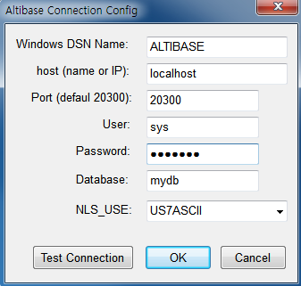

이 장은 Altibase ODBC 드라이버를
소개한다.

소개

ODBC(Open Database Connectivity)는 마이크로소프트가 만든, 데이터베이스에 접근하기 위한 표준 규격이다.
ODBC API를 사용하여 작성된 ODBC 애플리케이션이 데이터베이스에 접근하기 위해서는 ODBC Driver Manager 같은
ODBC 소프트웨어 외에, 접근하려는 데이터베이스에서 제공하는 별도의 모듈이나 드라이버가 필요하다. 이를 위해 Altibase
ODBC 드라이버가 제공된다. Altibase ODBC 드라이버는 ODBC 3.51 스펙을 준수한다.

Altibase ODBC 드라이버는 Altibase CLI 기반으로 작성되었으므로, Altibase ODBC 드라이버의 내부
동작이나 세부적인 지원 사항은 *Altibase CLI Manual*을 참조해도 무방하다.

데이터 타입

Altibase가 지원하는 SQL 데이터 타입과 ODBC 데이터 타입과의 맵핑 관계는 *Altibase CLI Manual*의
"B. 부록: 데이터형"을 참조한다.

ODBC API

ODBC API에 대한 자세한 내용은 ODBC API Reference
문서([http://msdn.microsoft.com/en-us/library/windows/desktop/ms714562%28v=vs.85%29.aspx](http://msdn.microsoft.com/en-us/library/windows/desktop/ms714562%28v=vs.85%29.aspx))를
참조한다.

ODBC Conformance Level

이 절은 현재 Altibase ODBC에서 현재 지원하는 함수들과 앞으로 지원 예정인 함수들, 그리고 지원되지 않는 함수들에
대하여 ODBC 함수의 적합성에 입각하여 설명한다.

ODBC의 적합성 레벨을 매기는 목적은 애플리케이션에게 ODBC 드라이버의 어떤 기능을 사용할 수 있는지에 대한 정보를 제공하기
위해서이다. 현재 ODBC 적합성 레벨은 Core, Level 1, Level 2의 3가지로 분류된다.어떤 함수의 적합성
레벨을 만족시키기 위해서는 드라이버가 그 레벨에 해당하는 모든 요구사항을 충족해야 한다.

아래에 표는 ODBC 3.x 기준의 적합성 레벨이다. 이는 ODBC 2.x의 적합성 레벨과 차이가 있다. ODBC 2.x에서의
적합성 레벨 1은 여기에서 core로 보면 된다.

Altibase ODBC 드라이버는 ODBC 3.51 스펙을 준수한다. 아래 표는 각 ODBC 함수의 레벨과 Altibase
ODBC 드라이버의 지원 여부를
나타낸다.

| 함수 이름           | 레벨   | 지원여부 | 지원예정 | 비고                                          |
| ------------------- | ------ | -------- | -------- | --------------------------------------------- |
| SQLAllocHandle      | Core   | O        |          |                                               |
| SQLBindCol          | Core   | O        |          |                                               |
| SQLBindParameter    | Core   | O        |          |                                               |
| SQLBrowseConnect    | Level1 | X        | X        |                                               |
| SQLBulkOperations   | Level1 | O        |          |                                               |
| SQLCancel           | Core   | O        |          |                                               |
| SQLCloseCursor      | Core   | O        |          |                                               |
| SQLColAttribute     | Core   | O        |          |                                               |
| SQLColumnPrivileges | Level2 | X        | X        | 칼럼에 대한 권한은 Altibase에서 지원하지 않음 |
| SQLColumns          | Core   | O        |          |                                               |
| SQLConnect          | Core   | O        |          |                                               |
| SQLCopyDesc         | Core   | X        | O        |                                               |
| SQLDescribeCol      | Core   | O        |          |                                               |
| SQLDescribeParam    | Level2 | O        |          | 완벽하게 지원한다고 볼 수 없음                |
| SQLDisconnect       | Core   | O        |          |                                               |
| SQLDriverConnect    | Core   | O        |          |                                               |
| SQLEndTran          | Core   | O        |          |                                               |
| SQLExecDirect       | Core   | O        |          |                                               |
| SQLExecute          | Core   | O        |          |                                               |
| SQLFetch            | Core   | O        |          |                                               |
| SQLFetchScroll      | Core   | O        |          |                                               |
| SQLForeignKeys      | Level2 | O        |          |                                               |
| SQLFreeHandle       | Core   | O        |          |                                               |
| SQLFreeStmt         | Core   | O        |          |                                               |
| SQLGetConnectAttr   | Core   | O        |          |                                               |
| SQLGetCursorName    | Core   | O        |          |                                               |
| SQLGetData          | Core   | O        |          |                                               |
| SQLGetDescField     | Core   | O        |          | ODBC 3.0                                      |
| SQLGetDescRec       | Core   | O        |          | ODBC 3.0                                      |
| SQLGetDiagField     | Core   | O        |          | ODBC 3.0                                      |
| SQLGetDiagRec       | Core   | O        |          | ODBC 3.0                                      |
| SQLGetEnvAttr       | Core   | O        |          |                                               |
| SQLGetFunctions     | Core   | O        |          |                                               |
| SQLGetInfo          | Core   | O        |          |                                               |
| SQLGetStmtAttr      | Core   | O        |          |                                               |
| SQLGetTypeInfo      | Core   | O        |          |                                               |
| SQLMoreResults      | Level1 | O        |          |                                               |
| SQLNativeSql        | Core   | O        |          |                                               |
| SQLNumParams        | Core   | O        |          |                                               |
| SQLNumResultCols    | Core   | O        |          |                                               |
| SQLParamData        | Core   | O        |          |                                               |
| SQLPrepare          | Core   | O        |          |                                               |
| SQLPrimaryKeys      | Level1 | O        |          |                                               |
| SQLProcedureColumns | Level1 | O        |          |                                               |
| SQLProcedures       | Level1 | O        |          |                                               |
| SQLPutData          | Core   | O        |          |                                               |
| SQLRowCount         | Core   | O        |          |                                               |
| SQLSetConnectAttr   | Core   | O        |          |                                               |
| SQLSetCursorName    | Core   | O        |          |                                               |
| SQLSetDescField     | Core   | O        |          | ODBC 3.0                                      |
| SQLSetDescRec       | Core   | O        |          | ODBC 3.0                                      |
| SQLSetEnvAttr       | Core   | O        |          |                                               |
| SQLSetPos           | Level1 | O        |          |                                               |
| SQLSetStmtAttr      | Core   | O        |          |                                               |
| SQLSpecialColumns   | Core   | O        |          |                                               |
| SQLStatistics       | Core   | O        |          |                                               |
| SQLTablePrivileges  | Level2 | O        |          |                                               |
| SQLTables           | Core   | O        |          |                                               |

# 설치 및 설정

이 장은 Altibase ODBC 드라이버를 설치하고 설정하는 방법을 설명한다.

설치

본 절에서는 Altibase ODBC 드라이버를 설치하는 방법에 대해서 기술한다.

유닉스 계열

유닉스 계열의 경우 Altibase 서버 또는 클라이언트 패키지를 설치할 때 ODBC 드라이버도 함께 설치된다. Altibase
서버 또는 클라이언트 패키지를 설치하는 방법은 *Installation Guide*를 참조한다.

64비트 패키지를 설치하면 아래와 같은 32비트와 64비트 ODBC 드라이버가 모두 $ALTIBASE\_HOME/lib에 설치될
것이다.

libaltibase\_odbc-64bit-ul32.so: SQLLEN의 크기가 32비트

libaltibase\_odbc-64bit-ul64.so: SQLLEN의 크기가 64비트

64비트 패키지에 두 개의 드라이버가 포함된 이유는 다음과 같다. 64비트 ODBC Driver Manager들은 SQLLEN
타입의 크기를 64bit로 정의하고 있다. 그러나, 유닉스 계열에서 사용 가능한 ODBC Driver Manager 중의
하나인 unixODBC가 버전과 컴파일 옵션에 따라 SQLLEN의 크기를 32bit 또는 64bit로 정의하기 때문에, 모두를
수용하기 위해 Altibase는 두 개의 드라이버를 제공한다. unixODBC를 사용하는 경우 SQLLEN 크기가 일치하는
드라이버를 선택하여 사용하기 바란다.

32비트 패키지를 설치하면 아래의 파일이 $ALTIBASE\_HOME/lib에 위치하게 된다.

libaltibase\_odbc.so

HP 운영 체제의 경우 위와 동일한 파일 이름에 확장자만 sl이다.

설정

본 절에서는 ODBC 드라이버를 설정하는 방법에 대해서 기술한다.

유닉스 계열

유닉스에서 ODBC 드라이버를 사용하기 위해서는 먼저 ODBC Driver Manager를 설치해야 한다. 유닉스용 ODBC
Driver Manager는 unixODBC Driver Manager와 iODBC Driver Manager가 있다. 각
Driver Manager에 대한 자세한 내용은 아래 링크를
​    참조한다.

- [http://www.unixodbc.org/](http://www.unixodbc.org/)
- [http://www.iodbc.org/](http://www.iodbc.org/)

DSN 추가

ODBC 애플리케이션에서 접근하려는 데이터베이스에 대한 DSN을 추가한다. \[데이터 원본(ODBC)\]의 사용자 DSN 또는
시스템 DSN 탭에서 "추가"를 누르면 아래의 대화상자가 나타난다. Altibase용 ODBC 드라이버를 선택하고
"마침"을 누른다.

"Altibase Connection Config" 창이 나타나면 아래의 속성들을 입력한다.

- Windows DSN Name: 데이터 원본의 이름을 입력한다.
- host (name or IP): 접속할 Altibase 서버가 위치하는 장비의 호스트 이름 또는 IP 주소를 입력한다.
- Port (default 20300): Altibase 서버의 listening 포트 번호를 입력한다.
  altibase.properties 파일에서 PORT\_NO 값을 확인하거나 ALTIBASE\_PORT\_NO 환경변수
  값을 확인한다.
- User: 데이터베이스 사용자 이름을 입력한다.
- Password: 데이터베이스 사용자 비밀번호를 입력한다.
- Database: 데이터베이스 이름을 입력한다.
- NLS\_USE: 클라이언트의 캐릭터셋을 입력한다.

"Test Connection"을 눌러서 접속이 정상적으로 되는지 확인할 수 있다. "OK"를 누른 후 DSN 탭에서 방금 입력한
이름으로 데이터 원본이 추가된 것을 확인할 수 있다.
